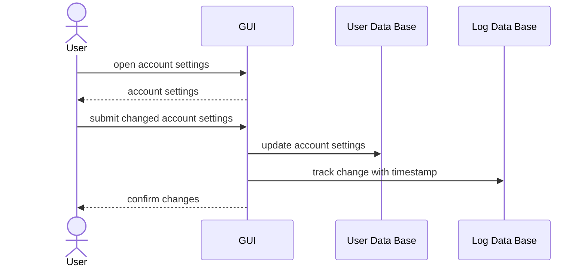

```mermaid
sequenceDiagram

actor user AS User

participant gui AS GUI
participant udb AS User Data Base
participant ldb AS Log Data Base

user ->> gui : open account settings
gui -->> user : account settings
user ->> gui : submit changed account settings
gui ->> udb : update account settings
gui ->> ldb : track change with timestamp
gui -->> user : confirm changes
```