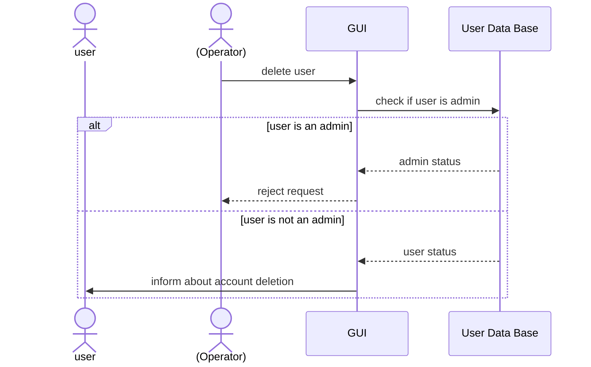

```mermaid
sequenceDiagram

actor user AS user
actor op AS (Operator)

participant gui AS GUI
participant udb AS User Data Base

op ->> gui : delete user
gui ->> udb : check if user is admin

alt user is an admin
    udb -->> gui : admin status
    gui -->> op : reject request
else user is not an admin
    udb -->> gui : user status
    gui ->> user : inform about account deletion
end

```