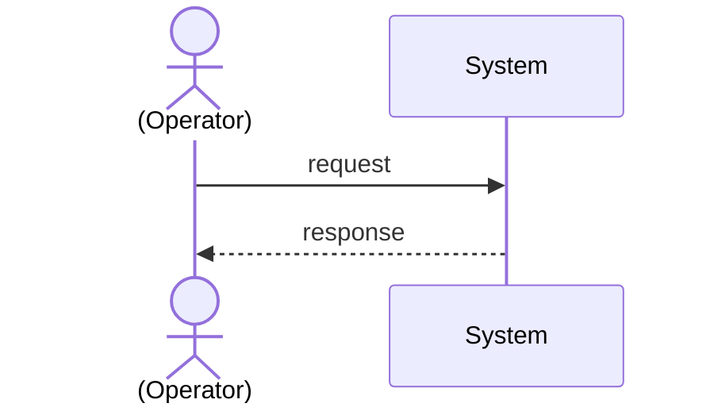

# Use Case Transformation

To ease the automatic assessment of several attributes of the use case annotation (e.g., the number of interactions), use case descriptions will be transformed into sequence diagrams.

## Format

The sequence diagrams will be implemented via the `mermaid` modelling language.

## Transformation Rules

The transformation shall happen according to the following rules:

- Every external actor (e.g., end users, customers, operators, or external systems) shall be represented as an `actor`, the system and any system-internal components (e.g., the GUI, database, or modules) shall be represented as `participant`.
- If a use case does not mention any external actor but the main scenario _implies_ at least one, then include a human actor with a vague name (e.g., "Operator"). If such an assumption must be made, indicate it by putting the name of the assumed actor or participant in brackets (i.e., "(Operator)")
- Pre- and postconditions listed as steps in a scenario are not recorded as steps. 
    - Formulations in the past tense (e.g., "Module updated to configure" or "Module prepared to deploy") *at the beginning of a scenario* indicate **preconditions**.
    - Formulations in the past tense (e.g., "Module successfully deployed") *at the end of a scenario* indicate **postconditions**.
- Steps where the verb implies both a request and a response (e.g., "A user *fetches* information*) are recorded as a request-response pair even if the response is not explicit.
